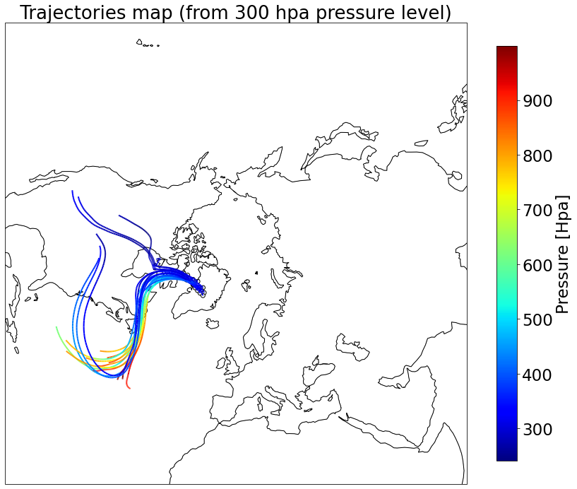
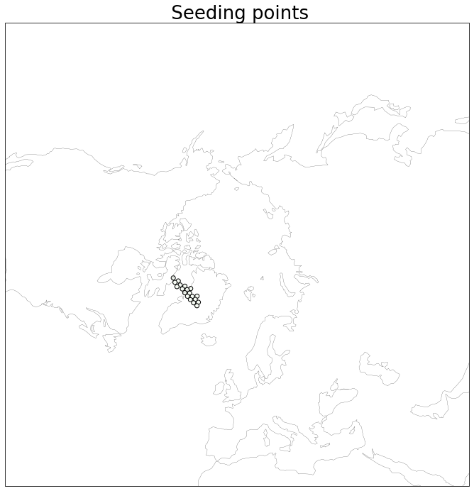

#######################
Lagrangian Trajectories
#######################
Info:
Lagrangian Trajectories is a specialized tool for conducting Lagrangian analysis for atmospheric science research. It utilizes wind data to track the movement of air masses, offering insights into atmospheric dynamics. This tool operates by interpolating wind data across three components (longitude, latitude, and pressure) to generate trajectories. These trajectories can be computed either forward or backward in time. The tool requires input data in the form of a netCDF file with a gridded format. Seeding points, specified by their coordinates in the x, y, and z directions, serve as the starting points for the computation of Lagrangian trajectories. This is an updated version of https://github.com/Vinita-D/LagranTraj/. This version allows to work with ERA5 model level grid which is not orthogonal : w is the actual pressure wind speed while the grid is in model level.
Please look at the tutorial for further details

###########
References
###########
- `Rivi`ere et al. (2021) <https://doi.org/10.5194/wcd-2-1011-2021>`_:
- `Wimmer. M et al. (2022) <https://doi.org/10.5194/wcd-3-863-2022>`_:

###########
Authors
###########
- Vinita Deshmukh 
- Meryl Wimmer 
- Philippe Arbogast
- Léo Ducongé
- Gwendal Rivière
- Sébastien Fromang
- Nicolas Chiabrando

###########
License
###########
This tool is open-source under the [your chosen license]. Feel free to use and modify it according to the license terms.
| Please cite **LagranTraj** in your publication: https://github.com/NicolasChiabrando/LagranTraj/.

============
Installation
============

Using pip
---------

Ideally install it in a virtual environment (development version, master).

.. code:: bash

    pip install git+https://github.com/NicolasChiabrando/LagranTraj/

==========
Tutorial
==========

Example: Computing trajectories
---------------------------------------
.. code-block:: python

   #import lagrantraj.trajectories as traj
   import lagrantraj.trajectories as traj
   
   #------------------------------------------------------------------------------
   # Reading input netcdf file
   #------------------------------------------------------------------------------
   """ def read_data(File_name,Root_input,list_var,list_var_advec,lat='latitude',lon='longitude',pres='isobaricInhPa')
   list_var are mandatory (u,v,w) wind componenets list_var_advect , additional variables to compute 
   thier values along the trajetories 
   substitude the coordinate variables (e.g lat,lon,press)"""
   
   list_var = ['u','v','w']
   list_var_advect = ['pv','pt']
   # ncfile combined with all the variables (u,v,w , pv,pt)
   filename = 'TC1279_cont_dec_merged.nc'  
   root_input = '/home/vinita/VINITA/ECMWF/'
   root_output = '/home/vinita/VINITA/ECMWF/'
   LON_nc,LAT_nc,P_nc,data = traj.read_data(filename,root_input,list_var_advect, list_var,lat='latitude',lon='longitude',pres='isobaricInhPa')
   
   lat_seeds = ([74., 74., 73., 73., 73., 73., 73., 73., 72., 72., 72., 72., 72.,
   72., 72., 72., 71., 71., 71.])
   lon_seeds = ([ -55.,  -45.,  -60.,  -56.,  -52.,  -48.,  -44.,  -40.,  -67.,
   -63.,  -59.,  -55.,  -51.,  -47.,  -43.,  -39.,  -71.,  -67.,
   -63.])
   pres_seeds = [30000]*19
   initial_time_step = 86
   
   """compute_trajectories(x0,y0,z0,initial_time_index,
        LON_nc,LAT_nc,P_nc,data,
        list_var,list_var_advec,
        trajectories_duration=None,
        dt_data=6.,dt_traj=0.5,
        niter=4,BACKWARD=True):
   X0,y0,z0 are the seeding points these points must be in the input ncfile
   dt_traj - temporal resolution of the input file in hours (eg. 1hrs)
   dt_traj =0.5 the trajectories output will be every 30 min.
   niter = 4 # dont change it 
   trajectories_duration = forward or backward in hours (eg = 72 for 72 hours)
   trajectories computation will be forward or backward if BACKWARD =True , BACKWARD = False , respectively"""
   #------------------------------------------------------------------------------
   # code to compute 
   #------------------------------------------------------------------------------
   
   TIME_traj, LAT_traj, LON_traj, P_traj, U_traj, V_traj, W_traj,VAR_traj=traj.compute_trajectories(lon_seeds,lat_seeds,pres_seeds,initial_time_step,
             LON_nc,LAT_nc,P_nc,data,
             list_var_advect, list_var,
             trajectories_duration=72,
             dt_data=3.,dt_traj=0.5,
             niter=4,BACKWARD=True)
   #------------------------------------------------------------------------------
   # Plotting
   #------------------------------------------------------------------------------
   P_traj=P_traj/100 # in hpa
   LON_traj=LON_traj
   LAT_traj=LAT_traj
   n_seeds =    LAT_traj.shape[0]
   color=P_traj
   
   
   import matplotlib.pyplot as plt
   from matplotlib.collections import LineCollection
   import cartopy.crs as ccrs
   import numpy as np
   
   fig = plt.figure(figsize=(15,12))
   ax=plt.subplot(projection=ccrs.NorthPolarStereo())
   ax.scatter(LON_traj[:,0],LAT_traj[:,0], c=P_traj[:,0], edgecolors='black',
   cmap='Greens',transform=ccrs.PlateCarree())
   
   #a= plt.contour(geopt.longitude,geopt.latitude[:],(geopt.z[0,26,:,:,1]/100),colors='black',transform=ccrs.PlateCarree())
   #plt.clabel(a, inline=1, fontsize=10)
   extent = 2500000
   ax.set_extent((-extent,extent,-extent,extent),crs=ccrs.NorthPolarStereo())
   plt.title(' Trajectories map (from 300 hpa pressure level) ', size=26)
   ax.set_extent([-180, 180,30, 90], ccrs.PlateCarree())
   ax.coastlines(linewidth=0.2)
   plt.show()
   
   for i_traj in range(n_seeds):
   points = np.array([LON_traj[i_traj,:], LAT_traj[i_traj,:]]).T.reshape(-1, 1, 2)
   segments = np.concatenate([points[:-1], points[1:]], axis=1)
   norm = plt.Normalize(np.nanmin(color),np.nanmax(color))
   lc = LineCollection(segments, cmap='jet', norm=norm,transform=ccrs.Geodetic())
   lc.set_array(color[i_traj,:])
   lc.set_linewidth(2)
   line = ax.add_collection(lc)
   plt.xlim([(np.nanmin(LON_traj))-0.5,(np.nanmax(LON_traj))+0.5])
   #print(np.nanmin(LON_traj)
   plt.ylim([(np.nanmin(LAT_traj))-0.5,(np.nanmax(LAT_traj))+0.5])
   
   #cbar_ax = fig.add_axes([0.92, 0.125, 0.02, 0.755])
   colo = fig.colorbar(lc,shrink=0.9)
   colo.ax.tick_params(labelsize=23)
   colo.set_label(label='Pressure [Hpa]', size=23)
   ax.set_extent([-180,180,20,90], ccrs.PlateCarree())
   ax.coastlines()
   plt.show()
   print('ok')
   
   #------------------------------------------------------------------------------
   # saving Data in NetCDF format
   #------------------------------------------------------------------------------
   """save_output_data(Root_output,initial_time_index,
                list_var,list_var_advec,
                TIME_traj, LAT_traj, LON_traj, P_traj, U_traj, V_traj, W_traj,VAR_traj)"""
   
   
   traj.save_output_data(root_output,initial_time_step,
                list_var_advect,list_var,
                TIME_traj, LAT_traj, LON_traj, P_traj, U_traj, V_traj, W_traj,VAR_traj)    
   

